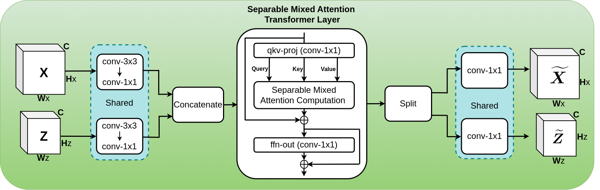

# [Separable Self and Mixed Attention Transformers for Efficient Object Tracking](https://openaccess.thecvf.com/content/WACV2024/papers/Gopal_Separable_Self_and_Mixed_Attention_Transformers_for_Efficient_Object_Tracking_WACV_2024_paper.pdf) [WACV2024] 
# Official implementation


## News
**`09-04-2024`**: C++ implementation of SMAT is available [here](https://github.com/goutamyg/MVT.cpp)

**`07-09-2023`**: The paper is available on [arXiv](https://arxiv.org/abs/2309.03979) now

**`28-08-2023`**: The pretrained tracker model is released

**`17-08-2023`**: The SMAT tracker training and inference code is released

**`14-08-2023`**: The paper is accepted at WACV2024

## Installation

Install the dependency packages using the environment file `smat_pyenv.yml`.

Generate the relevant files:
```
python tracking/create_default_local_file.py --workspace_dir . --data_dir ./data --save_dir ./output
```
After running this command, modify the datasets paths by editing these files
```
lib/train/admin/local.py  # paths about training
lib/test/evaluation/local.py  # paths about testing
```

## Training

* Set the path of training datasets in `lib/train/admin/local.py`
* Place the pretrained backbone model under the `pretrained_models/` folder
* For data preparation, please refer to [this](https://github.com/botaoye/OSTrack/tree/main)
* Uncomment lines `63, 67, and 71` in the [base_backbone.py](https://github.com/goutamyg/SMAT/blob/main/lib/models/mobilevit_track/base_backbone.py) file. 
Long story short: The code is opitmized for high inference speed, hence some intermediate feature-maps are pre-computed during testing. However, these pre-computations are not feasible during training. 
* Run
```
python tracking/train.py --script mobilevitv2_track --config mobilevitv2_256_128x1_ep300 --save_dir ./output --mode single
```
* The training logs will be saved under `output/logs/` folder

## Pretrained tracker model
The pretrained tracker model can be found [here](https://drive.google.com/drive/folders/1TindIEwu82IvtozwL4XQFrSnFE2Z6W4y)

## Tracker Evaluation

* Update the test dataset paths in `lib/test/evaluation/local.py`
* Place the [pretrained tracker model](https://drive.google.com/drive/folders/1TindIEwu82IvtozwL4XQFrSnFE2Z6W4y) under `output/checkpoints/` folder 
* Run
```
python tracking/test.py --tracker_name mobilevitv2_track --tracker_param mobilevitv2_256_128x1_ep300 --dataset got10k_test or trackingnet or lasot
```
* Change the `DEVICE` variable between `cuda` and `cpu` in the `--tracker_param` file for GPU and CPU-based inference, respectively  
* The raw results will be stored under `output/test/` folder

## Tracker demo
To evaluate the tracker on a sample video, run
```
python tracking/video_demo.py --tracker_name mobilevitv2_track --tracker_param mobilevitv2_256_128x1_ep300 --videofile *path-to-video-file* --optional_box *bounding-box-annotation*
```

## Visualization of tracker output and the attention maps


## Acknowledgements
* We use the Separable Self-Attention Transformer implementation and the pretrained `MobileViTv2` backbone from [ml-cvnets](https://github.com/apple/ml-cvnets). Thank you!
* Our training code is built upon [OSTrack](https://github.com/botaoye/OSTrack) and [PyTracking](https://github.com/visionml/pytracking)
* To generate the evaluation metrics for different datasets (except, server-based GOT-10k and TrackingNet), we use the [pysot-toolkit](https://github.com/StrangerZhang/pysot-toolkit)

## Citation
If our work is useful for your research, please consider citing:

```Bibtex
@inproceedings{gopal2024separable,
  title={Separable self and mixed attention transformers for efficient object tracking},
  author={Gopal, Goutam Yelluru and Amer, Maria A},
  booktitle={Proceedings of the IEEE/CVF Winter Conference on Applications of Computer Vision},
  pages={6708--6717},
  year={2024}
}
```
