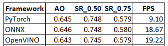
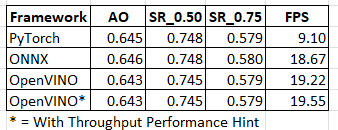
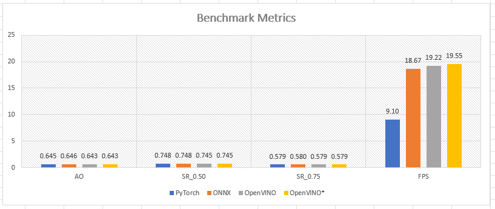
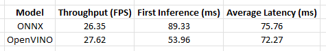
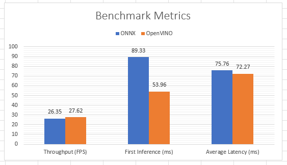

# Tracker Model Conversion & Inference - ONNX to OpenVINO

## Open Visual Inference and Neural Network Optimization (OpenVINO)

It is an open-source toolkit developed by Intel, designed to accelerate and optimize deep learning workloads, particularly for computer vision applications, on a variety of Intel hardware platforms. OpenVINO provides a range of tools, libraries, and runtime components that help developers deploy and run deep learning models efficiently on Intel CPUs, GPUs, FPGAs (Field-Programmable Gate Arrays), and VPUs (Vision Processing Units).

A few key features and components:

- Model Optimization: OpenVINO includes the Model Optimizer, which is used to optimize and convert deep learning models from popular frameworks like PyTorch, TensorFlow, and ONNX into an Intermediate Representation (IR) format. The IR format is a high-level intermediate representation that is hardware-agnostic and optimized for inference.

- Inference Engine: The Inference Engine is a runtime component that supports executing inference using optimized deep learning models on various Intel hardware platforms. It includes plugins for different hardware targets, enabling deployment on CPUs, GPUs, FPGAs, and VPUs.

- Heterogeneous Execution: OpenVINO allows developers to leverage the full range of Intel hardware, enabling heterogeneous execution to achieve high-performance inference across a variety of devices.

## Installation

To install OpenVINO, please refer to their [official website](https://docs.openvino.ai/2023.1/openvino_docs_install_guides_overview.html?VERSION=v_2023_1_0&OP_SYSTEM=WINDOWS&DISTRIBUTION=ARCHIVE) for a step-by-step process based on your hardware and operating system. OpenVINO supports multiple distributions e.g., docker, conda, pip, etc., and specifies the procedure to download and install.

It has two Runtime APIs i.e., Python and C++ API. For the scope of this project, I have worked with the Python API. Below are the steps for working with the Python API on a Linux OS using ``pip`` Python package manager.

- Step#1: Create a virtual environment. 
```
python -m venv openvino_env
```
- Step#2: Activate virtual environment
```
openvino_env\Scripts\activate
```
Note: Steps 1-2 can be skipped if you already have a Python virtual environment.

- Step#3: Upgrade pip to latest version
```
python -m pip install --upgrade pip
``` 
- Step#4: Download and install the package
```
pip install openvino==2023.1.0
```
 
## Hardware Specifications

- Processor: Intel(R) Core(TM) i3-1005G1 CPU @ 1.20GHz
- RAM: 12.0 GB 
- System Type: 64-bit operating system, x64-based processor

## OpenVINO Workflow


### 1) Model Preparation

All deep learning workflows begin with obtaining a model. You can choose to prepare a custom model or use a pre-trained model from an online database e.g., TensorFlow Hub, Torchvision models, Hugging Face, etc.

We choose option 1 with SMAT. Once the you have the model, you need to verify [OpenVINO supported model formats](https://docs.openvino.ai/2023.1/Supported_Model_Formats.html) for model conversion.

### 2) Model Optimization

This step relies heavily on compressing and optimizing the network either during or post-training. It is an optional (offline) step that aims at improving model performance and reducing model size by applying special optimization methods, such as 8-bit quantization, pruning, etc. OpenVINO offers optimization paths implemented in [Neural Network Compression Framework (NNCF)](https://github.com/openvinotoolkit/nncf). 

Note: I have not implemented this step as part of my implementation.

### 3) Model Conversion

OpenVINO offers a conversion API with two possible approaches: the Python API fucntions or the command line tool. It takes original deep learning models and converts them into the `Intermediate Representation`. It is a hardware-agnostic, high-level representation of a deep learning model that can be optimized and deployed efficiently on the Inference Engine.

You can use the Model conversion API in Python with the ``openvino.convert_model`` function. This function converts a model from its original framework representation, for example PyTorch or TensorFlow or ONNX, to the object of type ``openvino.Model``.

- Necessary imports.
```
import openvino as ov
```
- Convert model from supported format. You can specify additional function parameters. If not specified,
default values are used or are learnt from the model e.g., model inputs and outputs.
```
ov_model = ov.convert_model('model.onnx') 
```
There are two options to proceed: The resulting ``openvino.Model`` can be compiled with ``openvino.compile_model`` and inferred in the same application (Python script or Jupyter Notebook) or saved into a file using ``openvino.save_model`` for future use.

1- Save model to OpenVINO IR format for later use (preferred).
```
ov.save_model(ov_model, 'model.xml')
```
This command generates two files:
- ``model.xml``: Contains a serailized representation of the network topology.
- ``model.bin``: Contains a serialized representation of model weights and biases.

2- Compile and infer with OpenVINO.
```
compiled_model = ov.compile_model(ov_model)
```
Note: OpenVINO Runtime supports ONNX model format without conversion to OpenVINO IR and allows inference directly. However, the optimal method for maximum performance is to convert the underlying model i.e., PyTorch, TensorFlow, etc., to ONNX, and then to the OpenVINO IR.

### 4) Running Inference

OpenVINO Runtime uses a plugin architecture. Its plugins are software components that contain complete implementation for inference on a particular Intel® hardware device. The inference workflow is as shown below.


1) Create OpenVINO Runtime Core to manage available devices and read model objects.
    ```
    import openvino as ov
    core = ov.Core()
    ```
2) Compile the model to get information about model inputs or outputs by a tensor name or index. This approach is aligned with the majority of frameworks. You can specify configuration parameters such as device, performance hints, precision etc.
    ```
    compiled_model = core.compile_model("model.xml")
    ```
3)  Set inputs. Preprocess inputs into the accepted format, shape, etc.
    ```
    ov_inputs = {'x': x_dict[0].astype(np.float32),
                'z': self.z_dict[0].astype(np.float32)}
    ```
4) Running Inference. OpenVINO Runtime supports inference in either synchronous or asynchronous mode. If not explicitly specified, it will inference using the synchronous mode which is simple to execute, however may not be the most efficient use of the hardware's resources.

    OpenVINO Runtime offers multiple inference modes to allow optimum hardware utilization under different conditions. The most basic one is a single-device mode, which defines just one device responsible for the entire inference workload. You can specify the device using the function parameter ``device_name`` such as shown below. For more information on automated modes and supported devices, please visit OpenVINO's official [website](https://docs.openvino.ai/2023.1/openvino_docs_Runtime_Inference_Modes_Overview.html).
    ```
    results = compiled_model(ov_inputs, device_name="AUTO")
    ```

5) Process Inference Results. Based on the use-case and network, one can process raw outputs generated to evaluate the model performance e..g, accuracy, precision, inference speed, etc.

## Model Evaluation

The exisiting codebase provides functionality for processing model outputs for generating evaluation metrics i.e., bounding box predictions as well as inference time for each frame in a sequence. For the scope of this project, we are interested in viewing model inference speeds for all model formats.

### GOT-10k: Generic Object Tracking Benchmark

I have evaluated the model using ``GOT-10k: Generic Object Tracking Benchmark``, which is a large, high-diversity, one-shot database for generic object tracking in the wild. It consists of a number of standardized tests used to assess the performance, capabilities, or efficiency of hardware and/or software. 

Subsequently, I have evaluated the model using ``GOT-10K_TEST`` dataset which contains 180 sequences, each with a variable number of frames. The open-source dataset is available [here](http://got-10k.aitestunion.com/downloads). Model outputs generated via inference need to be uploaded onto to the [benchmark website](http://got-10k.aitestunion.com/submit_instructions) as per the specified instructions. To restructure and format these raw output files, go to the sub-driectory ``SMAT/misc`` and execute the following python script:

```
python file_structure.py
```

I have performed benchmarking for all model formats i.e., PyTorch, ONNX, & OpenVINO. Table 1 highlights metrics reported for each format.



Standardization and repeatability of the benchmark enable consistent and repeatable results. Based on the reported metrics, there is a siginificant speed-up of approxaimately 2x when inferencing with ONNX and OpenVINO as opposed to the native PyTorch format. However, there is a slight increase in throughput with OpenVINO in comparison to ONNX.

This can be attributed to several factors: OpenVINO is designed to accelerate and optimize deep learning on Intel hardware platforms and can leverage maximum utility when inferencing. An example of this is performance tricks such as optimizing for throughput in OpenVINO Runtime, enabling customized 
parameter values for device-specific settings i.e., optimal number of inference requests, number of streams ,etc.

To access these performance hints, I specify the ``ov::hint::performance_mode`` property for ``compile_model`` method.

```
compiled_model = core.compile_model(model=model_ov, device_name="CPU", 
                config={"PERFORMANCE_HINT": "THROUGHPUT"})
```
There are other hints such as ``LATENCY``, ``UNDEFINED`` etc. However, my focus was ``THROUGHPUT``, since that translates to highest FPS rates. I have performed model inference with performance hint specified and was able to further improve inference speed albeit slightly.



To visually demonstrate the difference in inference speed, reported in frames-per-second (FPS), a bar-chart is plotted below.



### OpenVINO Benchmark Python Tool 

The [Python benchmark_app](https://docs.openvino.ai/2023.1/openvino_inference_engine_tools_benchmark_tool_README.html) is automatically installed when you install OpenVINO. The application works with models in the OpenVINO IR (model.xml and model.bin) and ONNX (model.onnx) formats. It is a comprehensive application that not only outputs model inference properties such as device type, number of inference requests, inputs, outputs, etc., but prints the minimum, average, and maximum inferencing latency and average the throughput when benchmarking is complete.

To run benchmarking with default options on a model, use the following command:

```
benchmark_app -m model.xml
```

You can also provide various inputs for configuring execution parameters or easily tuning benchmarking to achieve better performance on your device. For example, to inference on a CPU device, with throughput performance hint, use the following command:
```
benchmark_app -m model.xml -hint throughput -d CPU
```

By default, the application will load the specified model onto the CPU and perform inferencing on batches of randomly-generated data inputs or specified input data for 60 seconds. I have performed benchmarking for the ONNX and OpenVINO model format and recorded the metrics reported.




The associated bar chart is as shown.




The significant speed up in terms of inference speed/throughput with the OpenVINO Python benchmark when compared to the GOT10K bencmark can be attributed to a few observations:
- The OpenVINO benchmark does not take into consideration input preprocessing when reporting inferencing time.
- It does consider model loading and intialization.
- It disregards the first inference time which generally takes up a lot more time as compared to the remaining inference requests.

In addition, the slight increase in throughput when inferencing with the OpenVINO format in comparison to the ONNX format is also reported, thus affirming our initial conclusions with the GOT10K benchmark.

